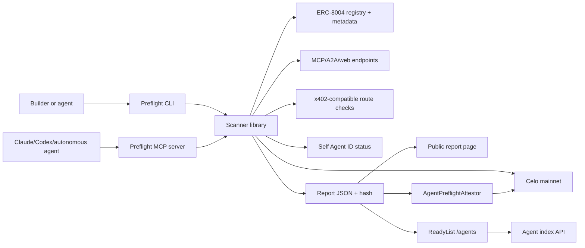

# 72 Hour Build Sprint

Goal: produce enough real evidence for a credible Frontier submission by 30 June 2026.

## Day 0: Scope lock

- [ ] Confirm project name: Celo Agent Preflight
- [ ] Create public GitHub repo
- [ ] Create landing README with one-sentence value prop
- [ ] Choose deploy stack: Solidity + Foundry, TypeScript + viem, simple report site
- [ ] Scope ReadyList as a report-backed `/agents` directory, not a full crawler
- [ ] Create deployment wallet and grant delivery wallet
- [ ] Choose first 3 target agents to scan
- [ ] Confirm x402 wording: compatible route checks, not unsupported facilitator claims

## Day 1: Scanner and report schema

Build the narrowest useful scanner:

1. `@celo-agent-preflight/scanner`
   - reads Celo ERC-8004 registry data;
   - resolves agent metadata URI;
   - validates required metadata fields;
   - checks declared service URLs.

2. `@celo-agent-preflight/cli`
   - command: `check`;
   - command: `report`;
   - outputs JSON and human-readable summary.

3. Report schema
   - check IDs;
   - status: pass/warn/fail/skipped;
   - severity;
   - observed evidence;
   - remediation;
   - source URL or chain reference;
   - deterministic report hash.

Deliverables:

- [ ] CLI runs against at least one Celo agent
- [ ] report JSON generated
- [ ] report hash reproducible
- [ ] initial docs committed

## Day 2: Celo attestation and public report

Build the evidence layer:

1. `AgentPreflightAttestor`
   - emits `AgentReportAttested(agentId, reportHash, score, reportURI)`;
   - deployed and verified on Celo mainnet.

2. Public report page
   - renders report JSON;
   - links report hash and explorer transaction;
   - shows pass/warn/fail checks and remediation.

3. ReadyList index
   - lists the scanned agents from published reports;
   - shows status, score, report hash, and attestation tx;
   - exposes a "Use this agent" JSON/CLI payload.

4. Celo activity check
   - reads recent activity for target wallet/contract;
   - marks missing/unknown activity honestly.

Deliverables:

- [ ] Celo mainnet deployment tx hash
- [ ] contract verification link
- [ ] 3 public report pages
- [ ] ReadyList `/agents` page with 3 entries
- [ ] 3 report attestation tx hashes
- [ ] Evidence Register updated

## Day 3: MCP, demo, and submission packaging

Build the agent-native interface:

- [ ] MCP server with `scan_agent`
- [ ] MCP server with `explain_remediation`
- [ ] optional `preflight_before_payment` stub
- [ ] x402-compatible response checker, at least response-shape/facilitator diagnostics
- [ ] Self Agent ID status check or clear TODO/status
- [ ] Complete GitHub README and docs
- [ ] Record 2-4 minute demo
- [ ] Complete KarmaGAP profile
- [ ] Fill Frontier answer draft
- [ ] Export evidence appendix as markdown/PDF
- [ ] Submit before 30 June 2026

## MVP architecture

## Cut scope aggressively

Do not build:

- generalized reputation scoring;
- complex dispute arbitration;
- multi-chain support;
- polished branding;
- generic agent chat;
- full marketplace;
- full smart contract audit replacement.

Build only what proves Celo mainnet infrastructure value.
